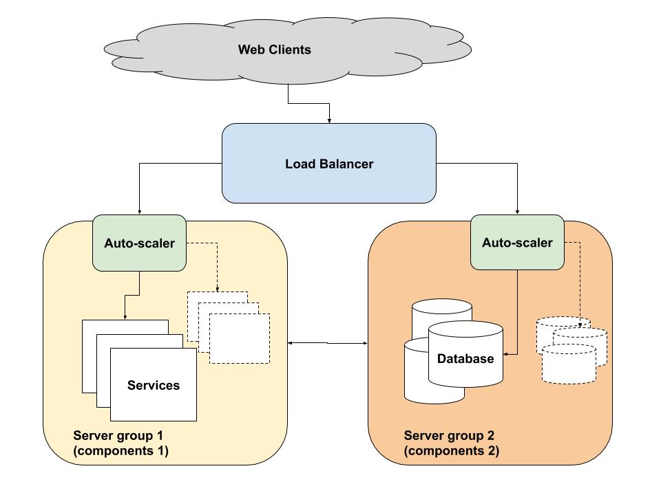

# autoscaling-webapp-right-way

## Preface

In this article we are going to learn some common solutions of how to automatically scale a modern web application. It aims to present a good practice/guideline to designing an auto-scalable web application.

## How does auto-scaling work

Essentially, auto-scaling works in two steps. First, it determines if the current resource availibity matches the resource demand. Second, it adjusts the availibility accordingly. For example, says we have built a news website, in the morning users causes a demand for 5 servers, but you only have 3 available. The auto-scaler should provision 2 more for you to meet the demand. Likewise, when users leave during the night, the auto-scaler should shrink the deployment to 1 or 2 servers to save money. 

To achieve this task, the auto-scaler requires monitoring information, which should be up to date and offering useful information about the status your cloud application. A good metric to monitor is one that relates to a single layer of your application. For instance, recording how many users want to access your service via a load balancer would be good. Monitoring CPU usage of a single unit, however, may be a bad idea since in case of under-provisioning, it does not shows how many additional resources is needed, only that there is a problem. A simple auto-scaler works in reactive fashion: resource availability is modified as the reaction when the threshold value has been passed. The typical reaction would be like:

* Add `X` servers
* wait until they have booted completely, and
* investigate if the resource availability matches demands, repeating as needed.

## The Old School

> The old-fashioned auto-scaling web application are usually consisted of a some classic components. They are ***Load Balancer***, couples of of ***Auto Scalers***, and a bunch of ***Server Instances***.

### Load Balancer

A load balancer serves a single point of contact for clients and distributes the workload across multiple target servers.

#### Routing configuration

The load balancer can be designed to route the requests to its targets using `protocol` and `port numbers`, regarding to both the inbound and outbound traffics.

e.g.

|Inbound Protocol|Outbound Protocol|Health Check Protocol|
|---|---|---|
|TCP|TCP|HTTP/HTTPS/TCP|
|SSL/TLS|TCP/TLS| HTTP/HTTPS/TCP|  
|UDP|UDP|HTTP/HTTPS/TCP|

The ports ranges from 1 to 65535

#### Routing Algorithm

* **The least connection**: Selects the service with the fewest active connections.
* **The least response time**: Selects the service with the lowest average response time.
* **Round Robin**: The most commonly used routing algorithm is [***Round-robin***](https://en.wikipedia.org/wiki/Round-robin_scheduling). After the load balancer takes the requests from clients, filetering with rules of protocols and port numbers, it then forwards the requests to a list of target servers attached to it in rotations.

#### Health Check

Health check is performed by the load balancers. It routinely generates http requests to the target instances's endpoint like `/heathz`, through a ping port, e.g., `80`, to examine the instance is healthy or not. If the status code is not equaled to `200` for couples of tries, the load balancer will unregister this instance from the sending list, until it goes back up healthy again. New requests will stop sending to the unhealthy targes, instead spread to other healthy instances.

#### Session Handling

* Sticky
* Non-sticky

#### Security Settings

### Auto Scaler

The auto scaler compoments are mostly sit in between the load balancer and groups of server instances. They monitor the workloads and runs some algorithms to decide when and how to scale up/down of the number of the running instances. An auto-scaler is considered good if it can predict the future requests and proactively manage the server instances.

#### Monitoring

The monitoring subsystem is responsible for accepting monitoring information and storing information of each metric in a time series database. Implement a program intercepts the requests from the load balancer, right before they are sent to those target instances. In that way we can easily observe the number of the read/writes reqeusts per seconds(minutes).

#### Auto Scaling Policy and Metrics

Then set the threshold to increase or to reduce the number of server instances. A typical predictable auto-scaler subsystem looks like the figure below:

The prediction subsystem analyzes the monitoring information and establishes a cloud deployment resize plan.

* **Predictor**: generate differect prediction values from different metric or models, then convert the prediction values as the input of analyzer. There are couple directions to design a predictor:

Think of weather forecasting, no one would use a single model ore a single metric to accurate predict weather. Predicting workloads is as the same philosophy. We always need more than one type of input and more than one type of model to predict server loads.

* **Analyzer**: accumulate all the prediction values from the Prdeictor and analyze the data with some kind of algorithms with the following techniques:

1. detecting recurring patterns
2. determine current demand variations
3. machine learning strategies

* **Auto-scaling Policies**: based on the results of Analyzer, the system then check all the scaling polies from a checklist. If all conitions match, then it will build a plan to do the scaling jobs.

* **Executor**: takes the commands with the data, requests cloud providers to boost or turn off machines with most likely some RESTful APIs they provided.

### Server Instacnes

Servers are the most bottom level of our web application. They can be some services, some databases, or some API endpoints serving those reqeusts come from the web clients. They are the workers who do the heavy calculations and perhaps read/write operations. Of cousrse, they are considered the basic units to perform the scaling procedures.

#### Vertical Scale

One solution we can come up with is to add more hardware resources, in terms of more processor units, more memory, or physical disks, within a single unit. In that way we have more powerful capabilities to serve the clients. This is called vertical scaling, also known as "scaling up". Vertical scaling sometimes referes to the software performance improvements, like optimizing algorithms and application code.

#### Horizontal Scale

Instead of vertical scaling, another approach is to add more units to the application's cloud architecture. This means adding more small capacity units instead of addning a single unit of larger capacity. The reqeusts for resources are then spread accross multiple units thus reducing the excess load on a single machine. This is called horizontal scaling, also called "scaling out".

## The Kubernetes Way

> Desinging your API in microservices and adding horizontal scaling might seems like the best choice nowadays, unless your application is already running in an on-premise environment and your will need to scale it because of unexpected large spikes in web traffic. [Kubernetes](https://github.com/kubernetes/kubernetes) is one of the best choice to help you achieve this.

### Ingress Controller (k8s load balancer)

[Ingress](https://kubernetes.io/docs/concepts/services-networking/ingress/) is a Kubernetes resource that encapsulates a collection of rules and configuration for routing external HTTP(S) traffic to internal services. We can set up HTTP Load Balancer with Ingress.

### HPA (k8s auto-scaler)

Kubernetes has a kind of resource called  Horizontal Pod AutoScaler. It automatically scales the pods in replication controller, deployment, and replicaset based on observed **CPU/Memory utilization** (or with custom metrics support, on some other application-supported metrics)

#### Monitoring

Regarding to application level's monitoring. the most commonly used service is [**Prometheus**](https://prometheus.io/). The powerful time series database constantly scrapes the metrics from different exporters offered by other third-party services. With fancy browser based UI, we can easily define our Service-Level Indicator(SLI)s, monitor our web application from different perspective of views. `node-exporter` might be a good start, it provides lots of imformation about the CPU, memory, and I/O disk usages, which are useful for the auto-scaler to do the jobs.

### Pods (microservices)

Kubernetes Pods are the basic unit. You can think of it as a baby computer(server) with couples of applications(containers) running inside it, which means a pod can run multiple containers. They represent the individual microservices to serve the clients. Use pods we could easily scale out a single container to multiple replicas to easily serve increasing requests.  

#### Rolling Upate/Rollback

Use [Helm](https://github.com/helm/helm) to deploy your application in Kubernetes cluster. Helm suports rolling update and rollback mechanisms letting you quickly switch your application back and forth in betwween different versions. In case of any testing scenarios or disaster reocvery, you can rollback your application in a short time.

## Auto-Scaling In Practice

* **What component(s) of the application do we want to auto-scale?**

Two aspects matter a lot to auto-scaling: how well these components scale horizontally (by adding and removing instances) and how they are deployed. Deploying all components on a single server is nice from a performance point of view (no network delays between components!), but really bad from a horizontal scaling perspective because of:

if the application is suffering because there are not enough instances of one component, scaling up the others as well does not make sense — neither performance- or cost-efficiency-wise; and that
if we simply clone the server instance, we will also need to perform considerable configuration updates to make sure that the service as a whole is kept in sync.
Our deployment strategy should only put components on a single server instance if it makes sense from a horizontal scaling point of view.

* **What capacity/size should each server instance have?**

Now that we know what components to run on each server, we need to figure out how such servers are started. We need to define the capacity requirements so we know which size of VM or container we need to provision from the cloud provider. Which VM or container size you need relates to what software you need to run, and how much additional work synchronizing instances requires. If adding a new instance requires very little in terms of synchronization, you can typically add many smaller instances. If each new instance needs to synchronize a lot with its peers, as in a distributed database, you will likely want to keep the number of instances lower, and instead opt for giving each plenty of capacity.

* **How do we automate making a new server instance operational?**

Next, we need to figure out how each new server should configure itself once it boots up. With auto-scaling, server instances will come and go at all times during the day. We need to automate that process, so it does not require a human system administrator logging in and taking care of each server instance. We can either do this via a simple shell script, or use a more complex but flexible solution via a configuration management tool such as Chef, Puppet, Salt, or Ansible.

Regardless of which configuration approach we choose, we typically need to install software, and configure the software to either register with some registry (e.g. a load balancer) or synchronize with its peers.

* **How do server instances find each other (service discovery) and synchronize/collaborate?**

When a new server instance starts, the components deployed in it must make their existence known to the rest of the components in some way. In the case of a web server, that typically means registering with a load balancer. In the case of a database server, that typically means contacting a master node and becoming a member with a suitable role. The appropriate steps must be added to the boot script or the configuration management software, so a new instance becomes a fully operational member in whatever group it belongs to.

Some less than obvious pitfalls exist here, too. Again, let’s use WordPress as an example (it is, after all, rather popular — powering some 60 million blogs out there!). Textual content (pages, blog posts, comments, etc.) is stored in the database, but when you upload a media file (images) to go with your blog entry, it is stored locally on disk. So if we just add a bunch of web server with WordPress-instances via auto-scaling, they will all correctly serve the textual content of your site, since they query the same database, but the media can only be served by the instance that happened to accept your upload. The resulting mess will lead to a blog that is half-broken, all of the time. To avoid that issue, you need to either use a networked file system (such as GlusterFS) to synchronize content across your instances, or use a content distribution network

* **What is a single server instance's capacity (in terms of our monitored metrics)?**

If we monitor good metrics, we then need to know how many servers are needed. If we know that a web server with our particular application can deal with X number of requests per second, that is great. Then we can adjust the size of our deployment according to that number — just dividing the number of requests we need to handle by X, and there is the number of server instances we need. As we explained in the second entry in this series, the auto-scaler will have to be clever about these values to avoid scaling up and down rapidly, to avoid stressing the system further.

ex. 100 reqeusts per second.

* **What limits on deployment size do we have?**

We need to set reasonable lower and upper limits for our deployment size. The lower limit ensures that we always have a reasonable baseline: there should never be fewer than a certain amount of server instances. At the very least, we need one server available, all the time. The upper limit is set by our budget. If you recall our second entry in this series, the capacity limits are enforced as the last step in the auto-scaler’s pipeline. This acts as a dependable safe-guard against exceeding the limits.

* Where are images and videos stored?
* How many read/write requests are recieved per seconds? Per minute?
* What is the level security required?
* Are this synchronous or ascynchronous requests?
* How is the website handling sessions?
* What are your loading balanceing considerations? (scaling, caching, session management, etc.)?

ex. Limit deployment sizes to between 1 to 20 instances.

* **What metric do we use for determine when to scale?**

As we described in the first entry in this series, some metrics are better suited for auto-scaling than others. What we are ideally looking for is a set of metrics that:

is related to only the pertinent set of components, and
is not capped by the performance of the current deployment size (as it is impossible to know by how much capacity demand exceeds availability if our reporting is capped by current availability).
This means that measuring e.g. CPU usage across all servers we have right now is bad, because high values only tells us that we need more servers, but not how many. It is therefore better to measure, e.g., how many of certain typical or time-critical queries against a database take to finish, or what the current request rate is, coming in through a load balancer. If we have insufficient capacity available, at least we know by how much we need to scale up.

ex. requests per second, as reported by the load balancer

> NOTE: It is good to pick a conservative number for a server instance’s capacity first and then test rigorously to find a value closer to the actual limit. The capacity is of course dependent on a number of factors, including how many CPU cores and how much RAM we assign to each server instance.
